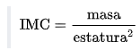
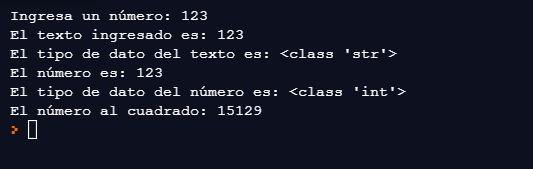
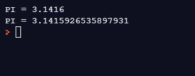
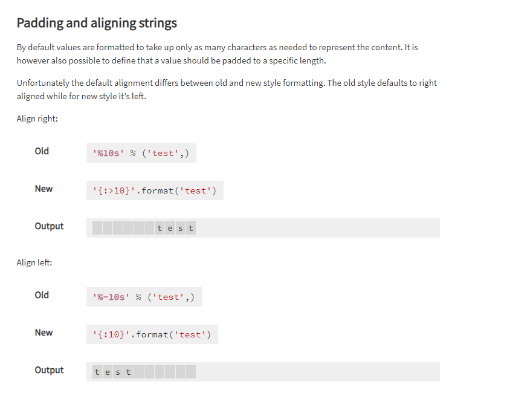

# Variables

Por [Dragón Nómada](https://dragonnomada.medium.com)

## ¿Qué son las variables?

Son nombres en el código asignados por el programador, para retener datos. Por ejemplo, `edad = 18`, `peso = 52.5`, `nombre = "Ana Ming"`, `frecuencia = 48.1 + 17.2j`, `casado = False`, `estudiante = True`, `calificacion = None`, etc.

## ¿Para qué sirven las variables?

Esencialmente sirven para retener datos o *"valores"* los cuales pueden ser _números_, _textos_, _valores lógicos_, _valores no especificados_, _colecciones_, _expresiones lambda_ y _objetos definidos_.

## ¿Qué tipos de datos se pueden almacenar en un programa?

* **números** (_enteros_, _decimales_ y _complejos_)
* **textos** (_simples_, _unicode_, _binarios_, _regulares_, etc.)
* **valores lógicos** (valores _booleanos_ de verdadero o falso)
* **valores no especificados** (valores _nulos_)
* **colecciones** (_listas_, _tuplas_ o _diccionarios_)
* **expresiones lambda** (funciones de una línea de código)
* **objetos definidos** (instancias de clases)

## ¿Cómo se usan las variables?

1. Se especifica un nombre que identificará en todo el programa el valor almacenado en la variable. Este puede ser construido con palabras, números y guiones bajos, pero no podrá empezar con un número. Ejemplo de nombres de variables **válidas** `miVariable`, `otra_variable`, `persona1`, `producto_16`, `__clave`, `miTortuga`. Ejemplo de nombres de variables **no válidas**: `123producto`, `23persona`, `mi-persona`, `@usuario`, `usuario@`, `mi$usuario`.
2. Asigna un valor inicial a la variable, si no sabes que valor asignar usa `None`. Ejemplo de asignaciones de variables: `edad = 18`, `peso = 54.2`, `calificacion = None`, `edades = [23, 18, 16, 24, 35]`.
3. Accede al valor de la variable mediante su nombre. Puedes usar el valor de una variable en cualquier lugar que requieras acceder al valor almacenado, por ejemplo, dentro de una suma (`x = a + b`), dentro de una condición (`if edad > 18:`), dentro de un rango (`range(a, b)`), dentro del llamado a una función (`suma(x, y)`).

### Ejemplo - Calcular la suma entre dos números

> Programa para calcular la suma de dos números

```py
# Definimos la variable `a` con el valor `123` (número entero)
a = 123
# Definimos la variable `b` con el valor `456` (número entero)
b = 456

# Calculamos la suma entre los dos números (`a` y `b`)
c = a + b

# Imprimimos el valor de `c`, que tendrá la suma entre el valor de `a` más el valor de `b`
print(c) # 579
```

[Ejecutar este código](https://replit.com/@DragonNomada/Suma#main.py)

### Ejemplo - Calcular el Índice de Masa Corporal

El [Índice de Masa Corporal](https://es.wikipedia.org/wiki/Índice_de_masa_corporal) o *IMC* es utilizado para saber la proporción de masa de una persona relativo a su estatura. Este número generalmente oscila entre 16 (muy delgado) y 40 (muy obeso). Le sirve a los médicos para identificar rápidamente sobre la obesidad o desnutrición de una persona. Se puede calcular fácilmente con la ecuación.



> Programa para calcular el IMC

```py
# Definimos la estatura
estatura = 1.72
# Definimos el peso
peso = 72.5

# Calculamos el IMC
# Los paréntesis no son necesarios ya que el exponente tiene mayor precedencia que la división, sin embargo, hay que cuidar siempre las divisiones
imc = peso / (estatura ** 2)

# Imprimimos el IMC
# Nota: En Python 2 podríamos requerir formatear el texto a imprimir.
print("IMC", imc)
```

[Ejecutar este código](https://replit.com/@DragonNomada/IMC#main.py)

## ¿Qué es la conversión de valores?

El [_Casting_](https://www.w3schools.com/python/python_casting.asp) o _coversión de valores_ permite convertir un valor definido de un tipo en otro tipo, por ejemplo, los números enteros pasarlos a decimales, los números decimales pasarlos a enteros, cadenas de texto convertirlas en números, números convertirlos a textos, etc.

Los tipos de datos más comunes en python son:

Tipo | Descripción | Función de Casting
--- | --- | ---
**int** | Número entero | `int(...)`
**float** | Número decimal | `float(...)`
**str** | Texto | `str(...)`

La _función de casting_ nos permitirá intentar pasar un valor al tipo deseado, por ejemplo, `int(x)` intentará convertir el valor de `x` en un entero. Esto obviamente podría no funcionar y en tal caso se producirá un `ValueError` y el programa fallará.

### Ejemplo - Leer un texto desde el teclado y convertirlo a un número entero

> Lee un texto desde el teclado y lo convierte a entero

```py
# La función input nos devuelve lo escrito con el teclado en la consola
# Muestra el mensaje y a continuación se espera a recibir del teclado lo escrito hasta pulsar la tecla Enter
texto = input("Ingresa un número: ")

print("El texto ingresado es:", texto)
print("El tipo de dato del texto es:", type(texto))

# Convierte el texto en número
# Si el texto no se puede convertir a número el programa fallará
numero = int(texto) # Podría fallar con ValueError

# Si el número pudo ser convertido lo imprimimos
print("El número es:", numero)
print("El tipo de dato del número es:", type(numero))
# Imprimimos también su valor al cuadrado para demostrar que es un número entero y se puede operar como tal
print("El número al cuadrado:", numero ** 2)
```

[Ejecutar este código](https://replit.com/@DragonNomada/Texto-a-Entero#main.py)

> Ejemplo del resultado



## ¿Qué son los textos?

Los _Textos_ o más formalmente _Cadenas de Texto_ son secuencias de caracteres que componen un dato llamado el _texto_ o _string_ en inglés. Los textos nos ayudan a retener cortas y largas secuencias de caracteres, como nombres, apellidos, direcciones postales, correos electrónicos, _urls_, enlaces multimedia, archivos de texto, cosas que teclea un usuario, etc.

El tipo de dato de los textos es **str** y su _función de conversión_ es `str(...)`. Si queremos convertir un número a texto usamos `str(123)`, lo que produce el texto `"123"`.

Los textos son útiles para generar reportes en formato de texto acerca de nuestros programas. En el siguiente ejemplo se muestra un reporte resultante de un programa que accede a una base de datos, extrae una lista de productos y devuelve algunos indicadores.

> Ejemplo de la salida de un programa que analiza una base de datos de productos

```text
Tiempo de Ejecución: 12.8s

Total de Productos: 192,534

Precio promedio: $192.84

Precio más alto: $2,784.16
Precio más bajo: $2.59

Total de productos arriba del promedio: 112,567
Total de productos abajo del promedio: 79,967

Productos con existencias menores a 10: 1,268
Productos sin existencias: 183
```

## ¿Cómo puedo formatear un texto con valores del programa?

El formato de textos es fundamental para poder producir reportes de texto y salidas adecuadas para el programador, para que este pueda verificar el buen funcionamiento del programa. Para dar formato a los textos existen varios modos, concatenar textos, inyectar variables en el texto o formatear los textos (más moderno). El último será el que utilizaremos por sus ventajas y modernidad. Sin embargo, puede revisar las diferencias en [https://pyformat.info](https://pyformat.info).

> Crear un texto con formato

```py
# Sintaxis: "Texto {} ... más texto {} ...".format(valor1, valor2, ...)

# Los textos pueden ser formateados mediante la pareja de llaves {}, la cuál usará el siguiente valor definido en el formato.

nombre = "Ana Ming"
edad = 18

descripcion = "El usuario se llama {} y tiene {} años".format(nombre, edad)

print(descripcion) # "El usuario se llama Ana Mingo y tiene 18 años"
```

[Ejecutar este código](https://replit.com/@DragonNomada/Formato-de-Textos#main.py)

Hay veces en los que el formato es sobre números decimales y necesitamos limitar el número de posiciones decimales.

> Formatear números decimales

```py
from math import pi

# Imprime el número PI, limitado a 4 decimales
print("PI = {:.4f}".format(pi))
# Imprime el número PI, limitado a 16 decimales
print("PI = {:.16f}".format(pi))
```

[Ejecutar este código](https://replit.com/@DragonNomada/Imprimir-PI#main.py)



## Ejercicios

### 1. Calcular la raíz cuadrada de un número

* Crea una variable llamada `x` con algún valor decimal, por ejemplo, `x = 123`.
* Crea una variable llamada `y` que sea igual a la raíz cuadrada de `x` (Pista: Eleva a `x` a la `1/2` o `0.5`, es decir, `y = x ** 0.5`).
* Imprime el valor de `x` y el de `y`.

### 2. Calcular la raíz cuadrada de un número leído desde el teclado

* Modifica el programa anterior para leer a `x` desde el teclado. (Pista: Usa `input(...)` y `float(...)` para leer el número, es decir, `x = float( input("Ingresa el número x: ") )`)

### 3. Reporte Hipotenusa

Crea un programa que leea dos valores referentes a los catetos de un triángulo, luego calcula la _hipotenusa_ que es la raíz cuadrada de la suma de los cuadrados de los catetos ([Teorema de Pitágoras](https://es.wikipedia.org/wiki/Teorema_de_Pitágoras)). Finalmete imprime un reporte con los tres valores, indicando cada uno.

* Lee el valor de un cateto (puedes usar la variable `a`).
* Lee el valor de otro cateto (puedes usar la variable `b`).
* Calcula el valor de la hipotenusa (puedes usar la variable `c`). Pista: `c = (a ** 2 + b ** 2) ** 0.5`.
* Crea un reporte de texto como el que se muestra a continuación.

> Ejemplo del resultado del programa

```text
Cateto | Cateto | Hipotenusa
------ | ------ | ----------
3      |      4 |          5
```

> Otro ejemplo del resultado del programa

```text
Cateto | Cateto | Hipotenusa
------ | ------ | ----------
1      |      1 | 1.41421356
```

**Pista**: Para poder lograr ese formato revisa [https://pyformat.info](https://pyformat.info).


