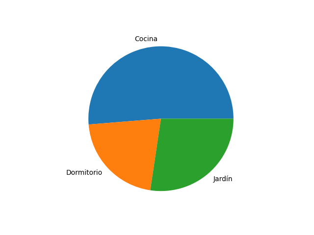

# Graficación

Por [Dragón Nómada](https://dragonnomada.medium.com)

## ¿Qué son las gráficas?

Las gráficas son figuras que nos permiten visualizar los datos para darnos una idea visual del comportamiento de ellos.

Entre las gráficas más importantes tenemos las gráficas de distribución que nos muestran el comportamiento de la dispersión de nuestros datos, las gráficas de correlación que nos muestran el comportamiento entre dos o más ejes de datos, los mapas y las gráficas 3D.

En la siguiente página podemos observar una lista completa a las gráficas más utilizadas en la ciencia de datos con descripción y ejemplos de código.

[https://www.python-graph-gallery.com](https://www.python-graph-gallery.com)


Para poder saber qué gráficas utilizar podemos consultar la siguiente página.

[https://www.data-to-viz.com](https://www.data-to-viz.com)


## La librería `matplotlib`

La librería `matplotlib` y el submódulo `pyplot` es uno de los más utilizados para comenzar a graficar en python.

Podemos consultar la documentación oficial en la siguiente página.

[https://matplotlib.org](https://matplotlib.org)


En la galería de ejemplo podemos ubicar alguna gráfica similar a lo que deseemos y explorar su código. Podemos consultar la galería de ejemplos en la siguiente página.

[https://matplotlib.org/stable/gallery/index.html](https://matplotlib.org/stable/gallery/index.html)


Por ejemplo, si desearamos usar una gráfica de pastel, bastaría ir al ejemplo en la siguiente página y modificar el código con nuestros propios datos.

[https://matplotlib.org/stable/gallery/pie_and_polar_charts/pie_features.html#sphx-glr-gallery-pie-and-polar-charts-pie-features-py](https://matplotlib.org/stable/gallery/pie_and_polar_charts/pie_features.html#sphx-glr-gallery-pie-and-polar-charts-pie-features-py)


## La librería `seaborn`

Otra de las librerías más utilizadas para graficar en python es la librería `seaborn` basada en `matplotlib`. La cuál está optimizada para manipular gráficas más estilizadas de una forma más sencilla.

Podemos consultar la documentación oficial de la librería `seaborn` en la siguiente página.

[https://seaborn.pydata.org](https://seaborn.pydata.org)


También podemos ver una galería de gráficas de ejemplo en la siguiente página.

[https://seaborn.pydata.org/examples/index.html](https://seaborn.pydata.org/examples/index.html)


Por ejemplo, si quisieramos usar una gráfica de calor, que es común para visualizar matrices de datos y sus valores más altos y bajos mediante una coloración automática. Podríamos consultar la siguiente página de la galería de ejemplos y alterar el código.

[https://seaborn.pydata.org/examples/spreadsheet_heatmap.html](https://seaborn.pydata.org/examples/spreadsheet_heatmap.html)


## Ejemplos

En la siguiente sección veremos algunos ejemplos de código ubicados en la carpeta `graficacion`.

> Histograma de datos

```py
# Muestra el histograma de una serie de datos
# Agrupa los datos en barras llamadas `bins`
# Cada `bin` agrupa los datos en un rango
# El eje horizontal representa los rangos de datos
# El eje vertical representa el número de datos en ese rango

import seaborn as sns
import matplotlib.pyplot as plt

serie = [28, 23, 25, 34, 33, 30, 19, 17, 23, 45, 29]

sns.histplot(serie)

plt.show()
```


> Densidad de datos

```py
# Muestra la densidad de los datos en varias series
# Cada serie es coloreada y sombreada

import seaborn as sns
import matplotlib.pyplot as plt

serie = [28, 23, 25, 34, 33, 30, 19, 17, 23, 45, 29]
serie_h = [28, 34, 33, 30, 19, 29]
serie_m = [23, 25, 19, 17, 23, 45]

# sns.histplot(serie, bins=8)
sns.kdeplot(serie, shade=True, color="purple")
sns.kdeplot(serie_h, shade=True, color="cornflowerblue")
sns.kdeplot(serie_m, shade=True, color="hotpink")

plt.show()
```


> Gráfica de Pastel

```py
# Muestra un pastel de datos
# Las etiquetas definen el nombre de cada categoría
# Los pesos indican la proporción o tamaño de la categoría

import matplotlib.pyplot as plt

labels = ["Cocina", "Dormitorio", "Jardín"]
sizes = [60, 25, 32]

plt.pie(sizes, labels=labels)

plt.show()
```



> Gráfica de Dona

```py
# Muestra una dona de datos
# Las etiquetas definen el nombre de cada categoría
# Los pesos indican la proporción o tamaño de la categoría
# Define el color de cada categoría
# Usa un círculo en blanco para convertir el pastel en dona

import matplotlib.pyplot as plt

labels = ["Cocina", "Dormitorio", "Jardín"]
sizes = [60, 25, 32]
colors = ["crimson", "lime", "indigo"]

plt.pie(sizes, labels=labels, colors=colors)

figure = plt.gcf()

figure.gca().add_artist(plt.Circle( (0,0), 0.7, color="white"))

plt.show()
```


> Gráfica de Cajas

```py
# Muestra una caja por cada serie de datos
# Se usa un dataframe de pandas
# Cada columna del dataframe es graficada manualmente

import seaborn as sns
import matplotlib.pyplot as plt

manzanas = [60, 64, 67, 55, 63, 64, 62]
peras = [44, 48, 43, 46, 44, 47, 55]
kiwis = [23, 24, 33, 28, 21, 23, 27]

import pandas as pd

df = pd.DataFrame({ "manzanas": manzanas, "peras": peras, "kiwis": kiwis, "e1": manzanas, "e2": manzanas, "e3": manzanas })

sns.boxplot(data=df.loc[:, ['manzanas', 'peras', 'kiwis', "e1", "e2", "e3"]])

plt.show()
```


> Gráfica de Calor

```py
# Muestra una gráfica de colores basados en una tabla
# Se usa un dataframe para definir la tabla
# El color muestra la intensidad de los datos
# Cada columna es el eje horizontal
# Cada fila es el eje vertical

import matplotlib.pyplot as plt
import seaborn as sns

data = {
    "manzanas": [30, 40, 25, 28],
    "peras": [35, 36, 32, 38],
    "kiwis": [28, 48, 54, 45],
}

import pandas as pd

df = pd.DataFrame(data)

print(df)

sns.heatmap(df)

plt.show()
```


> Grafica de Calor de una Matriz

```py
# Muestra los datos de una matriz en colores
# La intensidad dependerá de los datos
# Se usarán las columnas como eje horizontal
# Se usarán las filas como eje vertical

import matplotlib.pyplot as plt
import seaborn as sns

mat = [
    [1, 2, 3],
    [1, 3, 5],
    [4, 7, 6],
    [4, 7, 6],
    [4, 7, 6],
]

sns.heatmap(mat)

plt.show()
```


## Ejercicios

### 1. Crea un pastel que muestre la comparación entre el peso de las siguientes frutas

Fruta | Peso
--- | ---
Manzana | 10
Pera | 15
Mango | 48
Fresa | 23

### 2. Crea una dona que muestre la comparación entre los datos de hombres y mujeres

Categoría | Peso
--- | ---
Hombres | 48
Mujeres | 93

Colore la categoría `Hombres` de Azúl y la categoría `Mujeres` de Rojo.

### 3. Crea un Histograma de los siguientes datos

```py
serie = [
    4.78236246, 6.38912047, 5.03020491, 
    5.60738549, 5.44580563, 5.63543366, 
    4.86747511, 3.55107815, 4.37734185, 
    5.04551491, 4.51648969, 5.17692749, 
    5.02005706, 4.31972848, 3.4982131 ,
    5.13246294, 4.2256455 , 5.77978449, 
    6.71961881, 6.33609237
]
```

### 4. Crea una gráfica de Densidad de los siguientes datos

```py
serie = [
    4.78236246, 6.38912047, 5.03020491, 
    5.60738549, 5.44580563, 5.63543366, 
    4.86747511, 3.55107815, 4.37734185, 
    5.04551491, 4.51648969, 5.17692749, 
    5.02005706, 4.31972848, 3.4982131 ,
    5.13246294, 4.2256455 , 5.77978449, 
    6.71961881, 6.33609237
]
```

Usa el color rojo

### 5. Crea una gráfica de Calor para la siguiente matriz

```py
matriz = [
    [4.1499278 , 5.03239969, 5.38515378, 4.28469338, 5.08762798, 4.9798002 ],
    [4.70371865, 3.94057617, 4.82751137, 5.21431243, 4.69051008, 4.31456373],
    [3.65611102, 5.35694707, 5.24215886, 5.2792655 , 6.07842436, 4.34863722],
    [4.19466791, 5.18663398, 5.43462806, 3.65345266, 4.50497556, 3.02791388],
    [3.74664125, 5.60741616, 5.56053346, 5.44396395, 6.09659168, 5.02256713],
    [5.69274253, 5.32982561, 5.60169688, 4.40536579, 4.06851318, 6.00218629],
    [5.87698707, 4.82832401, 4.09514913, 5.91939751, 2.9934003 , 4.55949494],
    [4.7423539 , 4.80951438, 3.92385862, 4.50961062, 5.09878511, 4.34037753]
]
```
