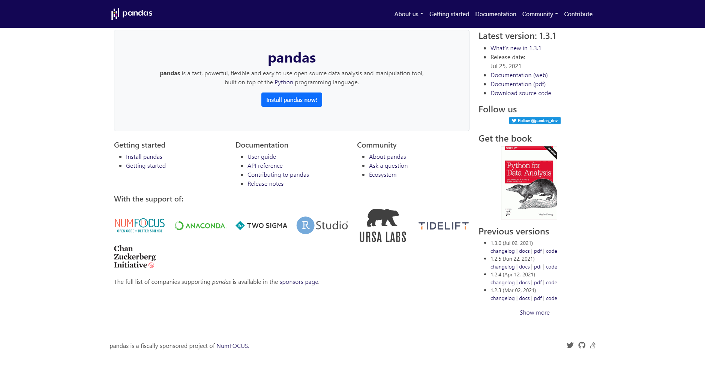
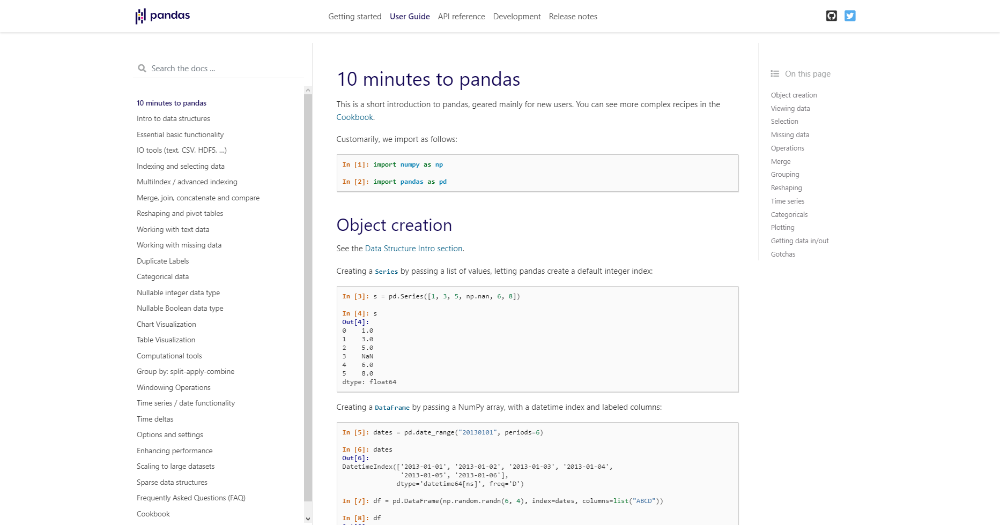
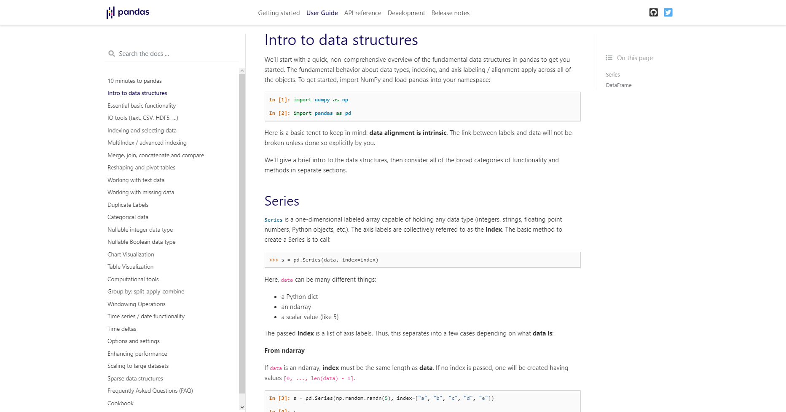

# Graficación

Por [Dragón Nómada](https://dragonnomada.medium.com)

## ¿Qué son es Pandas?

Pandas es una librería enfocada al análisis de datos parte del proyecto de [PyData](https://pydata.org).

Puedes consultar el sitio oficial en [https://pandas.pydata.org](https://pandas.pydata.org).



## ¿Cómo empezar con Pandas?

En la guía de usuario puedes encontrar un tutorial de Pandas en 10 minutos en la siguiente página [https://pandas.pydata.org/docs/user_guide/10min.html](https://pandas.pydata.org/docs/user_guide/10min.html).



Pero lo primero será entender las dos estructuras básicas de Pandas: Las **Series** y los **Dataframes**. Cuya explicación se encuentra disponible en [https://pandas.pydata.org/docs/user_guide/dsintro.html#dsintro](https://pandas.pydata.org/docs/user_guide/dsintro.html#dsintro).



## ¿Qué son las series?

Son arreglos de datos indexados y nombrados, que representan una columna de datos o una serie de datos. Su principal función es realizar operaciones unitarias sobre un **Eje de Datos**.

> Ejemplo de una serie de datos

```py
import pandas as pd

# Una serie con 5 edades distintas
edades = pd.Series([23, 18, 5, 14, 43])

print(edades)
# 0    23
# 1    18
# 2     5
# 3    14
# 4    43
# dtype: int64
```

[Ejecutar este código](https://replit.com/@DragonNomada/Pandas-Serie-Edades#main.py)

## ¿Cómo contruir una serie a partir de otras?

Podemos aplicar operaciones tradicionales a las Series, para obtener Series a partir de las expresiones matemáticas aplicadas.

> Calcular el IMC a partir de dos series

```py
import pandas as pd

estaturas = pd.Series([1.7, 1.56, 1.98, 1.67, 1.45])
pesos = pd.Series([67, 46, 58, 95, 48])

imc = pesos / estaturas ** 2

print(imc)
# 0    23.183391
# 1    18.902038
# 2    14.794409
# 3    34.063609
# 4    22.829964
# dtype: float64
```

[Ejecutar este código](https://replit.com/@DragonNomada/Pandas-Serie-IMC)

## ¿Cómo transformar una Serie?

Podemos transformar una serie a través de una función o una expresión lambda, para obtener otra serie con los datos transformados.

> Transformar una serie

```py
import pandas as pd

def etiquetaEdad(edad):
    if edad < 18:
        return "MENOR"
    else:
        return "MAYOR"

# Una serie con 5 edades distintas
edades = pd.Series([23, 18, 5, 14, 43])

# Transformamos la serie de edades en etiquetas
# <serie>.map(<función de transformación>)
etiquetas = edades.map(etiquetaEdad)

print(etiquetas)
# 0    MAYOR
# 1    MAYOR
# 2    MENOR
# 3    MENOR
# 4    MAYOR
# dtype: object
```

[Ejecutar este código](https://replit.com/@DragonNomada/Pandas-Serie-Edades-Etiquetas)

## ¿Qué es un Dataframe?

Es una estructura de Pandas que nos permite manipular datos tabulares (en filas y columnas).

> Crear un Dataframe a partir de un diccionario de listas

```py
import pandas as pd

# Creamos un dataframe a partir de un diccionario de listas
# Cada clave será el nombre de la columna
# Y cada lista serán los valores para cada fila en la columna
df = pd.DataFrame({
    "Nombre": ["Ana", "Beto", "Carla", "Eduardo"],
    "Edad": [23, 45, 67, 98],
    "Peso": [45, 78, 56, 60]
})

print(df)
#     Nombre  Edad  Peso
# 0      Ana    23    45
# 1     Beto    45    78
# 2    Carla    67    56
# 3  Eduardo    98    60
```

Podemos consultar la información de un Dataframe para saber cuánta memoria ocupa y qué columnas tiene, el número de registros (filas) y sus tipos de dato.

> Obtener la información de un Dataframe

```py
df.info()
# <class 'pandas.core.frame.DataFrame'>
# RangeIndex: 4 entries, 0 to 3        
# Data columns (total 3 columns):      
#  #   Column  Non-Null Count  Dtype   
# ---  ------  --------------  -----   
#  0   Nombre  4 non-null      object  
#  1   Edad    4 non-null      int64
#  2   Peso    4 non-null      int64
# dtypes: int64(2), object(1)
# memory usage: 224.0+ bytes
```

También podemos consultar un resumen de los estadísticos principales de las columnas que sean numéricas.

```py
print(df.describe())
#            Edad       Peso
# count   4.00000   4.000000
# mean   58.25000  59.750000
# std    32.01432  13.720423
# min    23.00000  45.000000
# 25%    39.50000  53.250000
# 50%    56.00000  58.000000
# 75%    74.75000  64.500000
# max    98.00000  78.000000
```

Cada columna en el Dataframe representará una Serie de datos nombrada con el nombre de la columna. Por lo que las columnas de un Dataframe son Series.

> Recuperar una serie de datos como la columna de un Dataframe

```py
# 1. Obtener los valores de una columna

print(df["Nombre"]) # Serie Nombre
# 0        Ana
# 1       Beto
# 2      Carla
# 3    Eduardo
# Name: Nombre, dtype: object

print(df["Edad"])   # Serie Edad
# 0    23
# 1    45
# 2    67
# 3    98
# Name: Edad, dtype: int64

print(df["Peso"])   # Serie Peso
# 0    45
# 1    78
# 2    56
# 3    60
# Name: Peso, dtype: int64
```

Igualmente podemos seguir definiendo columnas en el Dataframe mediante otra serie (esta puede ser calculada a partir de las series de otras columnas).

> Agregar una columna a patir de otras

```py
# 2. Agregar una columna con operaciones entre otras columnas

df["Fuerza"] = 10 * df["Peso"] / df["Edad"] # Operación: Registro por registro

print(df)
#     Nombre  Edad  Peso     Fuerza
# 0      Ana    23    45  19.565217
# 1     Beto    45    78  17.333333
# 2    Carla    67    56   8.358209
# 3  Eduardo    98    60   6.122449
```

Podemos acceder a los valores de un registro (fila) mediante el `iloc` y el índice de la fila.

```py
# 3. Obtener los valores de una fila (un registro)

print(df.iloc[1]) # Registro de Beto ("Beto", 45, 78, 1.7333)
# Nombre       Beto
# Edad           45
# Peso           78
# Fuerza    17.3333
# Name: 1, dtype: object
```

En algunos casos será útil obtener el Dataframe transpuesto, es decir, que ahora las columnas serán las filas y las filas serán las columnas.

```py
# 4. Obtener el dataframe transpuesto (Columnas <-> Filas)

print(df.T)
#               0        1        2        3
# Nombre      Ana     Beto    Carla  Eduardo
# Edad         23       45       67       98
# Peso         45       78       56       60
# Fuerza  19.5652  17.3333  8.35821  6.12245
```

## ¿Qué es un CSV?

Es un archivo de texto plano, dónde los valores son separados por comas en cada fila. La fila principal representa el nombre de las columnas y tiene extensión `csv`.

> Ejemplo de un CSV de datos (`imc.csv`)

```csv
"Nombre","Peso","Estatura"
"Ana",50.00,1.56
"Beto",67.00,1.72
"Carla",78.00,1.70
"Daniel",59.00,1.57
"Edna",63.00,1.45
"Fabian",78.00,1.84
```

Podemos cargar los datos del CSV como un Dataframe de pandas usando la función `read_csv`.

> Cargar los datos de un CSV como Dataframe

```py
import pandas as pd

# <ruta al proyecto>/ data/imc.csv
df = pd.read_csv("data/imc.csv")

print(df)
#    Nombre  Peso  Estatura
# 0     Ana  50.0      1.56
# 1    Beto  67.0      1.72
# 2   Carla  78.0      1.70
# 3  Daniel  59.0      1.57
# 4    Edna  63.0      1.45
# 5  Fabian  78.0      1.84
```

## Ejercicios

### 1. Crea un Dataframe con una lista de diccionarios con los siguientes datos

Fruta | Peso | Color
--- | --- | ---
Manzana | 60 | Rojo
Pera | 40 | Verde
Mango | 80 | Amarillo

### 2. Crea un CSV con los siguientes datos y cárgalos en un Dataframe

Fruta | Peso | Color
--- | --- | ---
Manzana | 60 | Rojo
Pera | 40 | Verde
Mango | 80 | Amarillo
Kiwi | 30 | Café
Plátano | 60 | Amarillo

### 3. Para el Dataframe anterior, crea una columna con el color numérico según la siguiente tabla

Color | Número
--- | ---
Rojo | 1
Amarillo | 2
Verde | 3
Café | 4

### 4. Investiga cómo se usa la función `to_csv()`

Guarda el Dataframe que tiene la columna con los colores numéricos en `frutas_color.csv`.
