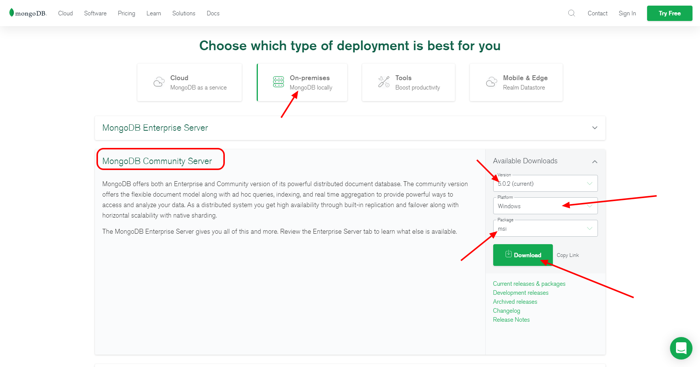
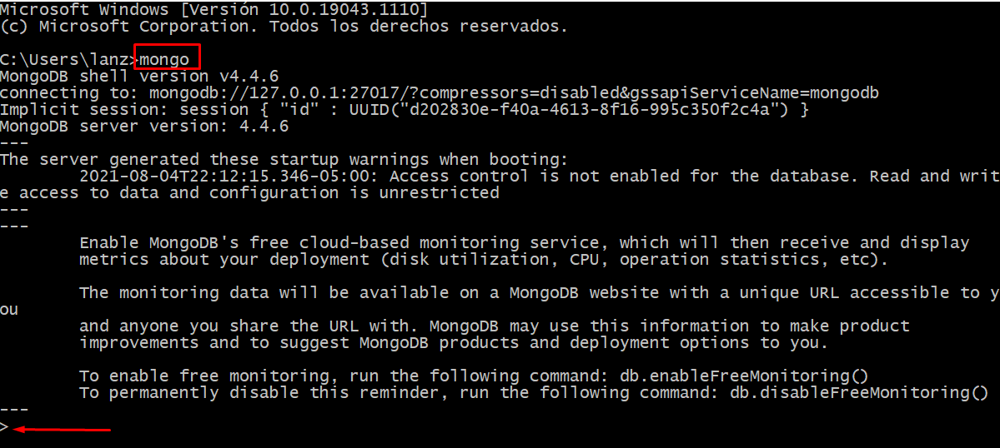

# MongoDB

Por [Dragón Nómada](https://dragonnomada.medium.com)

## ¿Qué es MongoDB?

Es una *Base de Datos NO-SQL* lo que significa que hay diferencias marcadas entre las bases de datos SQL y MongoDB.

### Naturaleza

MongoDB se centra en el **Documento** que es la unidad mínima en la que mongo almacena los datos de un registro.

El documento es similar a un objeto *JSON* y puede contener cualquier información asociada. Este es usado como *registro*, *contrato* o *cardex* de una entidad sobre la base de datos.

> Ejemplo de un Documento en MongoDB

```json
// Documento: `usuario #abc123`
{
    "_id": "abc123",
    "name": "Ana Ming",
    "email": "ana@gmail.com",
    "phone": "+5215512345678",
    "address": {
        "street": "Av. Siempre Viva",
        "number": "123",
        "floor": "N/A",
        "city": "Mexico City",
        "country": "Mexico",
        "code": "MX",
        "zip": "15950"
    }
}
```

Los documentos son agrupados en **Colecciones**, estas se encargan de realizar las operaciones de búsqueda, son como contenedores o cajas de documentos, también se les puede ver como portafolios o expedientes.

Una colección de usuarios contendrá los documentos sobre los usuarios, una colección de productos contendrá documentos con la información de cada producto. Las colecciones son utilizadas para mantener la integridad de las entidades (los documentos) y sirven como grupos o conjuntos de documentos. A estas se les puede insertar, actualizar, borrar o buscar documentos.

> Ejemplo de una Colección en MongoDB

```json
// Colección: `productos`
[
    { "_id": "producto-0001", ... },
    { "_id": "producto-0002", ... },
    { "_id": "producto-0003", ... },
    ...,
    { "_id": "producto-XXXX", ... },
]
```

Las colecciones son agrupadas en **Bases de Datos*. Una base de datos contendrá todas las colecciones referentes a un sistema. Se puede entender como el almacén de las colecciones o portafolios.

Una base de datos agrupará todas las colecciones usadas en el sistema y podrá accederlas.

> Ejemplo de una Base de Datos en MongoDB

```json
// Base de Datos: `tienda`
// Colección: `tienda.productos`
// Colección: `tienda.clientes`
// Colección: `tienda.vendedores`
// Colección: `tienda.proveedores`
// Colección: `tienda.ventas`
```

## ¿Cómo usar Mongo DB?

Para comenzar consulta la página [https://www.mongodb.com/es](https://www.mongodb.com/es).


Descarga Mongo DB e instálalo de la siguiente página.

[https://www.mongodb.com/try/download/community](https://www.mongodb.com/try/download/community)



Verifica que la instalación sea correcta ingresando a una terminal y escribiendo `mongo`. Deberías ingresar al shell.



## Conectarse a Mongo DB con Python

Usa la librería `pymongo` para conectarte. Puedes instalarla con `pip install pymongo`.

> Instalación de la librería `pymongo`

```bash
> pip install pymongo
```

Usa la clase `MongoClient` para crear un cliente de conexión.

> Crear un cliente de conexión a Mongo DB

```py
# pip install pymongo

from pymongo import MongoClient

client = MongoClient("mongodb://localhost/python-master")

print(client)

client.close()
```

## Insertar documentos

Recordemos que Mongo DB sirve para insertar documentos, con los datos de una entidad, por ejemplo, un alumno.

> Insertar el documento de un alumno en la colección `python-master.alumnos`

```py
from pymongo import MongoClient

client = MongoClient("mongodb://localhost/python-master")

db = client["python-master"]

alumnosCollection = db["alumnos"]

# https://pymongo.readthedocs.io/en/stable/api/pymongo/collection.html#pymongo.collection.Collection.insert_one
result = alumnosCollection.insert_one({
    "_id": "alumno-001", # Se puede omitir y mongo generará uno aleatorio
    "nombre": "Ana Ming",
    "email": "ana.ming28@gmail.com",
    "alias": "aming"
})

print(result.inserted_id)

# https://pymongo.readthedocs.io/en/stable/api/pymongo/collection.html#pymongo.collection.Collection.insert_many
result = alumnosCollection.insert_many([
    {
        "_id": "alumno-002", # Se puede omitir y mongo generará uno aleatorio
        "nombre": "Pepe Díaz",
        "email": "pepe.dia78@hotmail.com",
        "alias": "ppdi"
    },
    {
        "_id": "alumno-003", # Se puede omitir y mongo generará uno aleatorio
        "nombre": "Jorge Rojo",
        "email": "jorge_rojo.98@yahoo.com.mx",
        "alias": "jr98"
    }
])

print(result.inserted_ids)

client.close()
```

## Buscar documentos

Otra función principal de las colecciones es permitir la búsqueda de documentos, por ejemplo, el documento de un alumno con un correo específico.

> Buscar el documento de un alumno en la colección `python-master.alumnos`

```py
from pymongo import MongoClient

client = MongoClient("mongodb://localhost/python-master")

db = client["python-master"]

alumnosCollection = db["alumnos"]

query = {
    "email": "ana.ming28@gmail.com"
}

for alumno in alumnosCollection.find(query):
    print(alumno)

client.close()
```

## Actualizar documentos

También podemos actualizar los documentos de una colección que cumplan un filtro (consulta/`query`).

> Actualizar el documento de un alumno buscado por email

```py
from pymongo import MongoClient

client = MongoClient("mongodb://localhost/python-master")

db = client["python-master"]

alumnosCollection = db["alumnos"]

# query
filter = {
    "email": "dragonnomada123@gmail.com"
}

update = {
    "$set": {
        "alias": "Dragón Nómada 123"
    }
}

# https://pymongo.readthedocs.io/en/stable/api/pymongo/collection.html#pymongo.collection.Collection.update_one
# https://pymongo.readthedocs.io/en/stable/api/pymongo/results.html#pymongo.results.UpdateResult
result = alumnosCollection.update_one(filter, update)

print("Encontrados:", result.matched_count)
print("Modificados:", result.modified_count)
print("Ids modificicados:", result.upserted_id)

client.close()
```

## Eliminar Documentos

Finalmente podemos eliminar documentos de una colección que cumplan un filtro (consulta/`query`).

> Eliminar el documento de un alumno por alias

```py
from pymongo import MongoClient

client = MongoClient("mongodb://localhost/python-master")

db = client["python-master"]

alumnosCollection = db["alumnos"]

# query
filter = {
    "alias": "ppdi"
}

# https://pymongo.readthedocs.io/en/stable/api/pymongo/collection.html#pymongo.collection.Collection.delete_many
# https://pymongo.readthedocs.io/en/stable/api/pymongo/results.html#pymongo.results.DeleteResult
result = alumnosCollection.delete_many(filter)

print("Eliminados:", result.deleted_count)

client.close()
```

## Ejercicios

### 1. Crear una colección de frutas que tenga los siguientes datos

Fruta | Peso | Color
--- | --- | ---
Manzana | 60 | Rojo
Pera | 40 | Verde
Mango | 80 | Amarillo
Kiwi | 30 | Café
Plátano | 60 | Amarillo

### 2. Buscar las frutas de color `Amarillo`

Muestra los documentos encontrados en un formato adecuado.

```txt
+ --------- | ---- | --------- +
| Fruta     | Peso | Color     |
+ --------- | ---- | --------- +
| Mango     | 80   | Amarillo  |
| Plátano   | 60   | Amarillo  |
+ --------- | ---- | --------- +
```

### 3. Inserta una nueva fruta con los datos del usuario

Captura desde el teclado los datos de la nueva fruta e insertala.

### 4. Modifica todas las frutas `Amarillo` por `Amarilla`

Filtra y actualiza las frutas de color `Amarillo` y actualiza el color a `Amarilla`.

### 5. Elimina las frutas `Verde`

Elimina las frutas que sean de color `Verde`.
