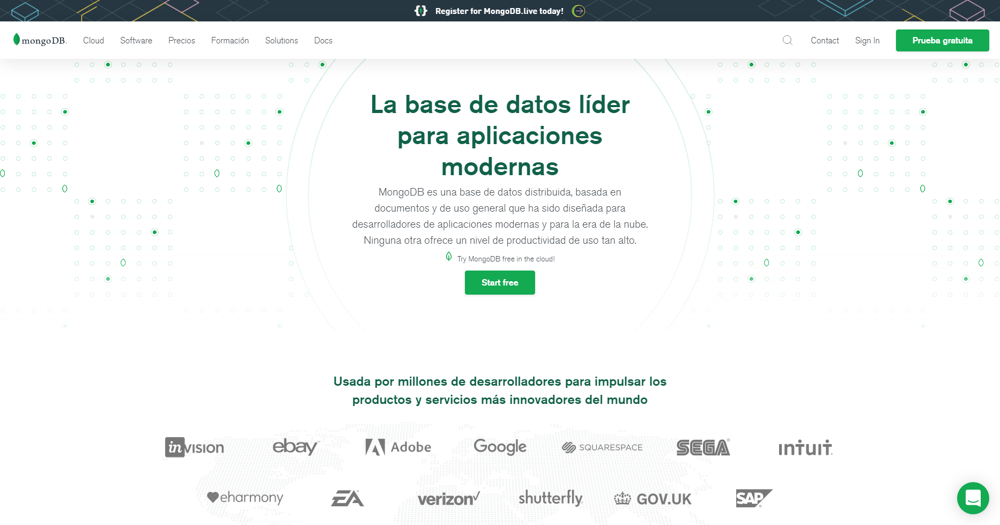

# MongoDB

Por [Dragón Nómada](https://dragonnomada.medium.com)

## ¿Qué es MongoDB?

Es una *Base de Datos NO-SQL* lo que significa que hay diferencias marcadas entre las bases de datos SQL y MongoDB.

### Naturaleza

MongoDB se centra en el **Documento** que es la unidad mínima en la que mongo almacena los datos de un registro.

El documento es similar a un objeto *JSON* y puede contener cualquier información asociada. Este es usado como *registro*, *contrato* o *cardex* de una entidad sobre la base de datos.

> Ejemplo de un Documento en MongoDB

```json
// Documento: `usuario #abc123`
{
    "_id": "abc123",
    "name": "Ana Ming",
    "email": "ana@gmail.com",
    "phone": "+5215512345678",
    "address": {
        "street": "Av. Siempre Viva",
        "number": "123",
        "floor": "N/A",
        "city": "Mexico City",
        "country": "Mexico",
        "code": "MX",
        "zip": "15950"
    }
}
```

Los documentos son agrupados en **Colecciones**, estas se encargan de realizar las operaciones de búsqueda, son como contenedores o cajas de documentos, también se les puede ver como portafolios o expedientes.

Una colección de usuarios contendrá los documentos sobre los usuarios, una colección de productos contendrá documentos con la información de cada producto. Las colecciones son utilizadas para mantener la integridad de las entidades (los documentos) y sirven como grupos o conjuntos de documentos. A estas se les puede insertar, actualizar, borrar o buscar documentos.

> Ejemplo de una Colección en MongoDB

```json
// Colección: `productos`
[
    { "_id": "producto-0001", ... },
    { "_id": "producto-0002", ... },
    { "_id": "producto-0003", ... },
    ...,
    { "_id": "producto-XXXX", ... },
]
```

Las colecciones son agrupadas en **Bases de Datos*. Una base de datos contendrá todas las colecciones referentes a un sistema. Se puede entender como el almacén de las colecciones o portafolios.

Una base de datos agrupará todas las colecciones usadas en el sistema y podrá accederlas.

> Ejemplo de una Base de Datos en MongoDB

```json
// Base de Datos: `tienda`
// Colección: `tienda.productos`
// Colección: `tienda.clientes`
// Colección: `tienda.vendedores`
// Colección: `tienda.proveedores`
// Colección: `tienda.ventas`
```

## ¿Cómo usar Mongo DB?

Para comenzar consulta la página [https://www.mongodb.com/es](https://www.mongodb.com/es).



