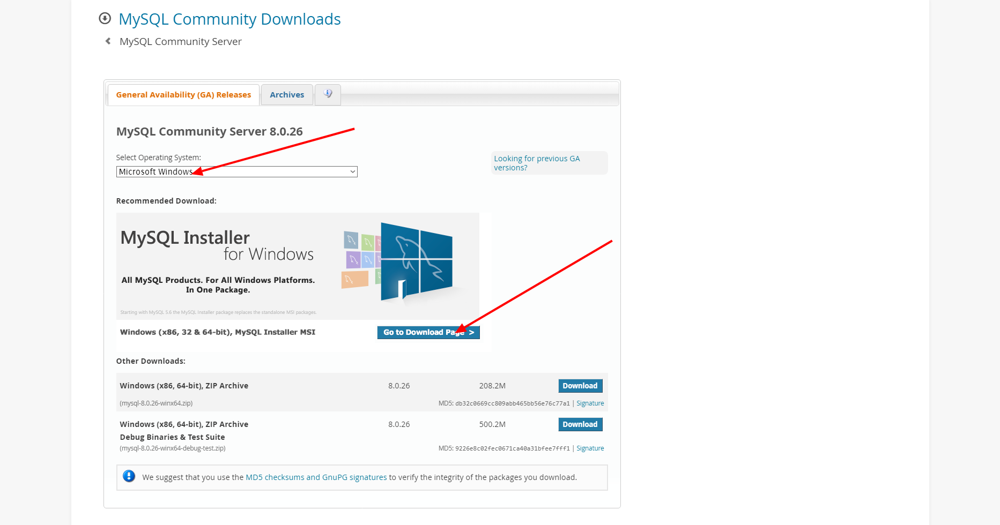
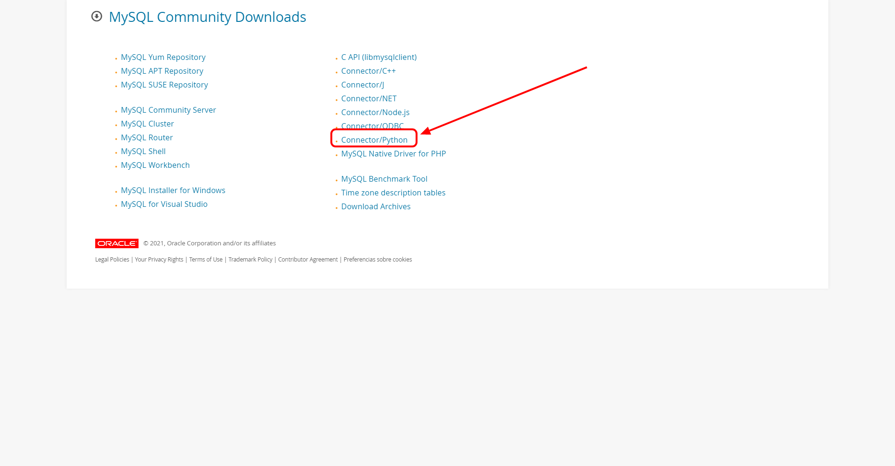

# MongoDB

Por [Dragón Nómada](https://dragonnomada.medium.com)

## ¿Qué es MySQL?

Es una base de datos basada en el pseudolenguaje llamado SQL (Structured Query Language / Lenguaje de Consulta Estructurado).

Podemos consultar más información en la página oficial.

[https://www.mysql.com](https://www.mysql.com)


### Naturaleza

La unidad básica de almacenamiento en mysql es el **Registro** el cuál contiene la información de una entidad en cada uno de sus campos definidos.

> Ejemplo de un registro de `alumno`

```txt
(id_alumno: 12345, matricula: 'c016950A', nombre: 'Ana Ming', carrera: 'Matemáticas')
```

Los registros se agrupan en tablas. Es decir una **Tabla** es un conjunto de registros y la definición de cada uno de sus campos.

> Ejemplo de una tabla de `alumnos`

ID_ALUMNO [INT] | MATRICULA [VARCHAR(15)] | NOMBRE [VARCHAR(60)] | ...
--- | --- | --- | ---
... | ... | ... | ...
12345 | c016950A | Ana Ming| ...
12346 | c016951A | Pepe Díaz | ...
12347 | d016900B | Mary Kondo | ...
... | ... | ... | ...

Las tablas se pueden relacionar con otras tablas usando tablas intermedias o claves foráneas.

El conjunto de tablas conforma la **Base de Datos**. Una base de datos contendrá todas las tablas relacionadas en un sistema.

> Ejemplo de una base de datos de `escuela`

```txt
# Base de datos: ESCUELA
# Tabla: ALUMNOS
# Tabla: PROFESORES
# Tabla: ADMINISTRATIVOS
# Tabla: DEPARTAMENTOS
# Tabla: CARRERAS
# Tabla: MATERIAS
# Tabla: ALUMNO_PROFESORES
# Tabla: PROFESOR_ALUMNOS
# Tabla: PROFESOR_CARRERAS
# Tabla: ...
```

## Instalar MySQL

Podemos descargar una vesión soportada por la comunidad en la página oficial.

[https://dev.mysql.com/downloads/mysql/](https://dev.mysql.com/downloads/mysql/)



También deberemos instalar el conector para Python de la página de descargas.

[https://dev.mysql.com/downloads/](https://dev.mysql.com/downloads/)



## Conectarse a MySQL

Para conectarse debemos proveer las credenciales y usar el módulo `mysql.connector` en su método `connect`.

> Crear un cliente de conexión a MySQL

```py
# https://dev.mysql.com/downloads/connector/python/

import mysql.connector as mysql

client = mysql.connect(
    host = "localhost",
    user = "<user>", # root
    passwd = "<password>" # your password
)

print(client)

client.close()
```

## Ejecutar sentencias SQL

Podemos ejecutar sentencias de `SQL` desde el cursor del cliente de conexión, para por ejemplo, crear una base de datos.

**IMPORTANTE:** Las instrucciones que alteren la base de datos como crear bases de datos o tablas, insertar, actualizar o eliminar registros, entre otras, deberán efectuar un `commit` sobre el cliente usando `client.commit()` para que se efectuen.

> Ejemplo de la creación de una base de datos

```py
# https://dev.mysql.com/downloads/connector/python/

# https://www.datacamp.com/community/tutorials/mysql-python

import mysql.connector as mysql

client = mysql.connect(
    host = "localhost",
    user = "root",
    passwd = "password"
)

cursor = client.cursor()

result = cursor.execute("CREATE DATABASE python-master")

client.commit()

print(result)


client.close()
```

**IMPORTANTE:** Cierra siempre el cliente de conexión, para no saturar las conexiones máximas a la base de datos.

## Crear una tabla

Podemos crear nuevas tablas mediante la sentencia `SQL` estructurada con dicho propósito.

> Ejemplo de crear una tabla de `alumnos`

```py
# https://dev.mysql.com/downloads/connector/python/

# https://www.datacamp.com/community/tutorials/mysql-python

import mysql.connector as mysql

client = mysql.connect(
    host = "localhost",
    user = "root",
    passwd = "password",
    database = "python-master" # OJO: Indicamos la base de datos
)

cursor = client.cursor()

result = cursor.execute("""
CREATE TABLE alumnos (
  id_alumno INT NOT NULL AUTO_INCREMENT,
  nombre VARCHAR(45) NOT NULL,
  email VARCHAR(45) NOT NULL,
  alias VARCHAR(45) NULL,
  PRIMARY KEY (id_alumno))
""")

client.commit()

print(result)

client.close()
```

## Insertar un registro

Podemos insertar registros sobre las tablas usando `INSERT INTO <table> (<field 1>, <field 2>, ...) VALUES (<value 1>, <value 2>, ...)`.

> Ejemplo de la inserción de una alumno sobre la tabla de alumnos

```py
# https://dev.mysql.com/downloads/connector/python/

# https://www.datacamp.com/community/tutorials/mysql-python

import mysql.connector as mysql

client = mysql.connect(
    host = "localhost",
    user = "root",
    passwd = "password",
    database = "python-master" # OJO: Indicamos la base de datos
)

cursor = client.cursor()

result = cursor.execute("""
INSERT INTO alumnos 
    (`nombre`, `email`, `alias`) 
    VALUES 
    ('Ana Ming', 'ana.ming28@gmail.com', 'aming')
""")

# Es importante al insertar o actualizar enviar el commit para que se ejecute en la base de datos
client.commit()

print(result)

client.close()
```

## Buscar registros

Podemos buscar registros lanzando la sentencia SQL `SELECT <fields> FROM <table> [<constraints>]`. 

Usamos `cursor.execute(sql)` y `cursor.fetchall()` para iterar todos los resultados.

> Ejemplo de la búsqueda de alumnos

```py
# https://dev.mysql.com/downloads/connector/python/

# https://www.datacamp.com/community/tutorials/mysql-python

import mysql.connector as mysql

client = mysql.connect(
    host = "localhost",
    user = "root",
    passwd = "password",
    database = "python-master" # OJO: Indicamos la base de datos
)

cursor = client.cursor()

cursor.execute("""
SELECT * FROM alumnos
""")

for alumno in cursor.fetchall():
    print(alumno)

client.close()
```

## Ejercicios

### 1. Crear una colección de frutas que tenga los siguientes datos

Fruta | Peso | Color
--- | --- | ---
Manzana | 60 | Rojo
Pera | 40 | Verde
Mango | 80 | Amarillo
Kiwi | 30 | Café
Plátano | 60 | Amarillo

### 2. Buscar las frutas de color `Amarillo`

Muestra los documentos encontrados en un formato adecuado.

```txt
+ --------- | ---- | --------- +
| Fruta     | Peso | Color     |
+ --------- | ---- | --------- +
| Mango     | 80   | Amarillo  |
| Plátano   | 60   | Amarillo  |
+ --------- | ---- | --------- +
```

### 3. Inserta una nueva fruta con los datos del usuario

Captura desde el teclado los datos de la nueva fruta e insertala.

### 4. Modifica todas las frutas `Amarillo` por `Amarilla`

Filtra y actualiza las frutas de color `Amarillo` y actualiza el color a `Amarilla`.

### 5. Elimina las frutas `Verde`

Elimina las frutas que sean de color `Verde`.
