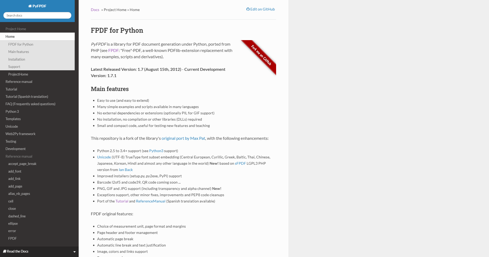
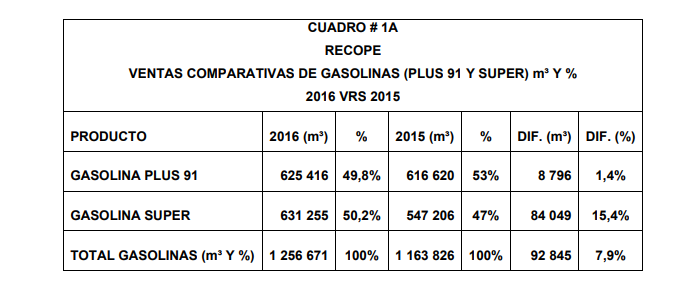

# Generación de Reportes

Por [Dragón Nómada](https://dragonnomada.medium.com)

## ¿Qué es un Reporte?

Los reportes nos permiten mostrar información condensada sobre los resultados de cálculos y operaciones sobre nuestros datos. Estos pueden ser de TEXTO o GRÁFICOS. Generalmente unimos textos y gráficos para presentar un reporte PDF integral.

## ¿Cómo puedo construir reportes PDF?

Podemos usar la librería `fpdf` instalada mediante `pip install fpdf` la cuál es ligera y tiene una potente documentación disponible en la siguiente página.

[https://pyfpdf.readthedocs.io/en/latest/](https://pyfpdf.readthedocs.io/en/latest/)



Esta librería es una de las más conocidas en el mundo antiguo de la programación y bastante sencilla de utilizar.

## Crear un PDF

En sólo 3 líneas de código podemos generar un pdf vacío.

> Ejemplo de la generación de un PDF vacío

```py
# pip install fpdf

from fpdf import FPDF

pdf = FPDF()

pdf.output("reportes/hello.pdf")
```

## Configurar la página y agregar celdas de texto

Podemos configurar la página en las unidades de nuestro agrado y también agregar celdas de texto, todo con las funciones sencillas `add_page` y `cell`.

> Ejemplo de configuración de página y agregación de texto

```py
# pip install fpdf

from fpdf import FPDF

# [Orientación] "P" - vertial o portrait | "L" - horizontal o landscape
# [Unidades] "cm" - centímetros | "mm" - milímetros | "in" - pulgadas | "pt" - puntos
# [Formato] "A4" - casi tamaño carta | "Letter" - tamaño carta | "Legal" - tamaño oficio | "A<x>" - estándar A0, A1, A2, ...

pdf = FPDF(orientation="L", unit="in", format="A4")

pdf.add_page()

pdf.set_font(family="Arial", style="BIU", size=24)

pdf.cell(w=0, h=1, txt="Hello world!", border=1, ln=1, align="C", fill=0, link="https://google.com")

pdf.set_font(family="Times", style="I", size=12)

pdf.cell(w=0, h=1, txt="Hola mundo!", border=0, ln=1, align="R", fill=0, link=None)
pdf.cell(w=0, h=1, txt="¿Cómo estás?", border=0, ln=0, align="R", fill=0, link=None)

pdf.output("reportes/hello_world.pdf")
```

## Incluir imágenes

Podemos agregar imágenes mediante la función `image`.

Observa que también configuramos la fuente, el ancho y alto en algunos elementos.

> Ejemplo de agregación de una imagen al PDF

```py
# pip install fpdf

from fpdf import FPDF

pdf = FPDF(unit="pt")

pdf.add_page()

pdf.set_font("Times", style="B", size=24)

pdf.cell(0, 24, txt="Reporte con Imágenes", align="C", ln=1)

page_size = 595 # A4: 595pt x 842pt (en modo vertical)

pdf.image("reportes/graficas/g2.png", x = page_size / 4, w = page_size / 2)

pdf.set_font("Arial", style="I", size=10)

pdf.cell(0, 10, txt="Histograma de edades", align="C", ln=1)

pdf.output("reportes/reporte_con_imagenes.pdf")
```

## Ejercicios

### 1. Crea un PDF con la portada de una tesis

Ejemplo.


### 2. Crea un PDF con la siguiente tabla


