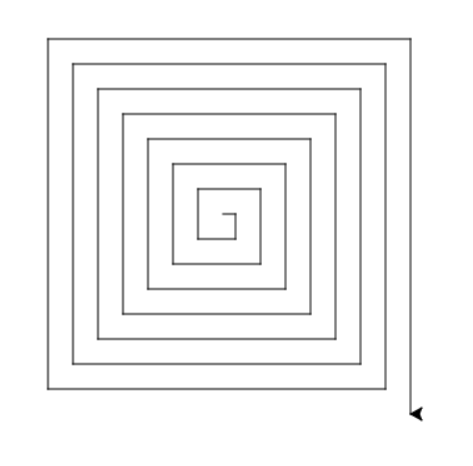

# Funciones

Por [Dragón Nómada](https://dragonnomada.medium.com)

## ¿Qué son las funciones?

Son estructuras fundamentales para la abstracción de código. Se basan idealmente en la recepción de parámetros de entrada y el retorno de una salida, de forma que se logran abstraer los conceptos de máquina y autómata.

> Sintaxis de una función

```py

# Forma canónica
def <nombre>(<arg1>, <arg2>, ..., <argN>):
    ...(bloque de la función)
    return <resultado o salida>

```

## ¿Para qué se utilizan las funciones?

Principalmente para abstraer tareas y código. Una función resuleve una tarea o proceso del sistema mediante los parámetros necesarios, por ejemplo, descargar un archivo de internet, copiar un archivo a otra ubicación, leer el contenido de un archivo, calcular el valor promedio de una lista de números, graficar una serie de datos, etc.

Imagina que quieres programar un robot para que realice distintas activades que implican movimiento, como recolectar frutos, limpiar la basura en el suelo, etc.

> Ejemplo de funciones sobre las tareas soportadas por un Robot

```py
def recolectar_fruto(posicion):
    if hay_fruto_en(posicion):
        abrir_brazo("derecho")
        bajar_brazo("derecho")
        cerrar_brazo("derecho")
        alzar_brazo("derecho")
        voltar_brazo("derecho")
        abrir_brazo("derecho")
    
def recolectar_basura(posicion):
    if hay_fruto_en(posicion):
        abrir_brazo("izquierdo")
        bajar_brazo("izquierdo")
        cerrar_brazo("izquierdo")
        alzar_brazo("izquierdo")
        voltar_brazo("izquierdo")
        abrir_brazo("izquierdo")
```

## ¿Qué es el proceso de abstracción?

El proceso de abstracción implica detectar rutinas de código similares, que pueden ser generalizadas mediante parámetros y colocadas en el bloque de una función. A este proceso se le llama formalemente *Refactorización de Código*.

> Ejemplo de la refactorización de código sobre las funciones de un robot

```py
def recolectar(posicion):
    tipo = que_hay_en(posicion)

    if tipo == "fruto":
        brazo_a_utilizar = "derecho"
    elif tipo == "basura":
        brazo_a_utilizar = "izquierdo"
    else:
        print("No hay nada por recolectar")
        return False # Salimos de la función indicando que no se recolectó nada

    abrir_brazo(brazo_a_utilizar)
    bajar_brazo(brazo_a_utilizar)
    cerrar_brazo(brazo_a_utilizar)
    alzar_brazo(brazo_a_utilizar)
    voltar_brazo(brazo_a_utilizar)
    abrir_brazo(brazo_a_utilizar)

    return True # Salimos de la función indicando que si se recolectó algo
```

## Ejemplo de funciones

> Suma de dos números

```py
def suma(a, b):
    return a + b

c = suma(123, 456)

print(c) # 579
```

[Ejecutar este código](https://replit.com/@DragonNomada/Suma-1#main.py)

> Distancia Euclideana entre dos puntos

```py
def distancia(x1, y1, x2, y2):
    dx = x2 - x1
    dy = y2 - y1
    d = (dx ** 2 + dy ** 2) ** 0.5
    return d

d = distancia(1, 2, 5, 7)

print("La distancia de (1, 2) a (5, 7) = {:.2f}".format(d))
```

[Ejecutar este código](https://replit.com/@DragonNomada/Distancia-Euclideana#main.py)

> Suma de los números de una lista

```py
def suma_lista(lista):
    s = 0
    for x in lista:
        s = s + x # s += x
    return s

resultado = suma_lista([1, 2, 3, 4, 5, 6, 7])

print(resultado) # 28
```

[Ejecutar este código](https://replit.com/@DragonNomada/Suma-Lista#main.py)

> Calcular el factorial de un número `n * (n - 1) * (n - 2) * ... * 3 * 2 * 1`

```py
def factorial(n):
    # Condición de paro
    if n <= 1:
        return 1

    # Salida basada en la recursión factorial(n) = n * factorial(n - 1)
    return n * factorial(n - 1)

f5 = factorial(5)

print("5! = {}".format(f5)) # 5! = 120
```

[Ejecutar este código](https://replit.com/@DragonNomada/Factorial#main.py)

> Dibujar una espiral cuadrada

```py
import turtle

def espiral(n):
    turtle.speed(0)
    for i in range(n):
        turtle.forward(10 * (i + 1))
        turtle.right(90)

espiral(30)
```

[Ejecutar este código](https://replit.com/@DragonNomada/Espiral-Cuadrada#main.py)



## Funciones del sistema operativo

### 1. Comprobar si un archivo existe y sus permisos

> Comprobar si un archivo existe y sus permisos

```py
# https://docs.python.org/es/3.10/library/os.html#os.access

import os

if os.access("datos/archivo.txt", os.F_OK):
    print("El archivo existe")

if os.access("datos/archivo.txt", os.R_OK):
    print("El archivo puede ser leído")

if os.access("datos", os.W_OK):
    print("La carpeta tiene permisos de escritura")

# Observa que negamos con `not`
if not os.access("datos/archivo.txt", os.X_OK):
    print("El archivo no puede ser ejecutado")
```

[Ejecutar este código](https://replit.com/@DragonNomada/OS-Access#main.py)

### 2. Manipulación de Archivos y Directorios

> Manipular los archivos y directorios

```py
# https://docs.python.org/es/3.10/library/os.html

import os

directorio_actual = os.getcwd()

print("Carpeta actual: {}".format(directorio_actual))

print("Creando la carpeta datos/resultados...")
os.makedirs("datos/resultados") # Crea la carpeta `datos` y adentro `resultados`

print("Eliminando la carpeta datos/resultados")
os.rmdir("datos/resultados")

print("Ejecutando el comando `ls -r -la`")
os.system("ls -r -la")
```

[Ejecutar este código](https://replit.com/@DragonNomada/OS-Files-and-Folders#main.py)

## Prácticas

### 1. Encontrar el elemento menor en una lista

Crea una función que reciba una lista y devuelva la posición del elemento menor.

[Ver la solución](https://replit.com/@DragonNomada/Elemento-Menor-en-Lista#main.py)

### 2. Ordenar una lista con el método de la burbuja

[Ver la solución](https://replit.com/@DragonNomada/Metodo-de-la-Burbuja#main.py)

Crea una función que reciba una lista y devuelva la lista con los elementos ordenados, usando el método de la burbuja.

### 3. Calcular el coseno

Crea una función que calcule el coseno a partir de las sumas parciales.

## Funciones compuestas

Una función compuesta es aquella que recibe otra función como parámetro de entrada. Son útiles para delegar el cómputo interno, por ejemplo, una función que tenga que filtrar elementos y le pregunte a otra función si el elemento debería ser filtrado. O una lista que tenga que sumar elementos, pero le pregunte a otra función que valor debería sumarse para cada elemento.

> Ejemplo de una función compuesta para filtrar elementos

```py
# Crea un filtrador de listas
# recibe la lista y el filtro
def filtrador(lista, filtro):
  # Crea una lista filtrada vacía
  lista_filtrada = []
  # Para cada elemento en la lista
  for elemento in lista:
    # Si filtro al elemento, entonces
    if filtro(elemento):
      # Agrega elemento a la lista filtrada
      lista_filtrada.append(elemento)
  # Regresa la lista filtrada
  return lista_filtrada

# Crea un filtro de números pares
# recibe un elemento
def filtro_pares(elemento):
  # Determina si el elemento es par
  # Si es divisible por 2 es par
  if elemento % 2 == 0:
    # Regresa que sí es par
    return True
  else:
    # Sino, regresa que no es par
    return False
  # Podríamos regresar directamente la respuesta
  # return elemento % 2 == 0

def filtro_mayores_10(elemento):
  # Determina si el elemento es mayor o igual a 10
  if elemento >= 10:
    # Regresa que sí es mayor a 10
    return True
  else:
    # Sino, regresa que no es mayor a 10
    return False
  # Podríamos regresar directamente la respuesta
  # return elemento >= 10

mi_lista = [1, 5, 11, 21, 8, 17, 95, 24, 29, 2, 6]

pares = filtrador(mi_lista, filtro_pares)

mayores_10 = filtrador(mi_lista, filtro_mayores_10)

print( pares )

print( mayores_10 )
```

[Ejecutar este código](https://replit.com/@DragonNomada/Filtro#main.py)

## Parámetros listados

> pendiente

## Parámetros nombrados

> pendiente

## Funciones generadoras

> pendiente

## Ejemplo (Clase)

* Funciones Estadísticos - [https://replit.com/@DragonNomada/FE1-Estadisticos#main.py](https://replit.com/@DragonNomada/FE1-Estadisticos#main.py)
* Funciones sobre textos - [https://replit.com/@DragonNomada/FE2-Textos#main.py](https://replit.com/@DragonNomada/FE2-Textos#main.py)

## Ejercicios

### 1. Calcular el área de un círculo

Crea una función que dado un radio, devuelva el área de un círculo (`pi x radio ^ 2`).

### 2. Determinar si un punto está dentro de un rectángulo alineado

Crea una función que determine si un punto `(x, y)` está dentro de un rectángulo alineado al eje horizontal y vertical descrito por los puntos `(a, b), (a + w, b), (a + w, b + h), (a, b + h)`. Puedes solicitar en la función `(a, b, w, h)`.

### 3. Resolver la ecuación cuadrática `ax^2 + bx + c = 0`

Crea una función que devuelva la solución para `x` dada la ecuación de segundo grado `ax^2 + bx + c = 0`. Pista, usa la ecuación general que la resuelve.
