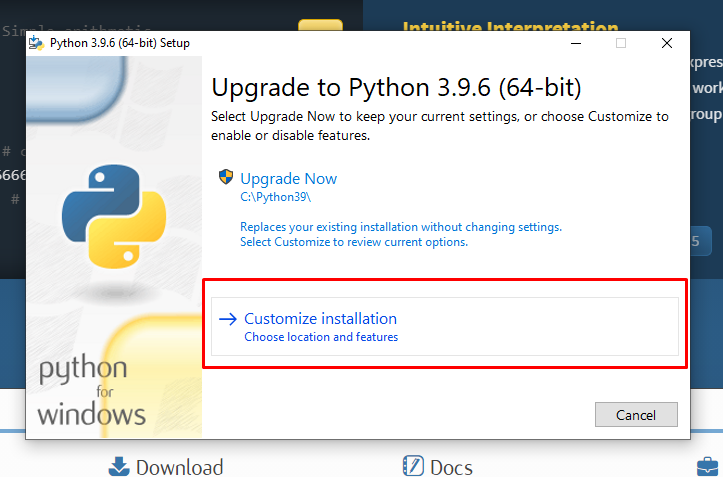
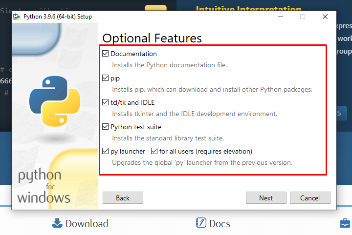
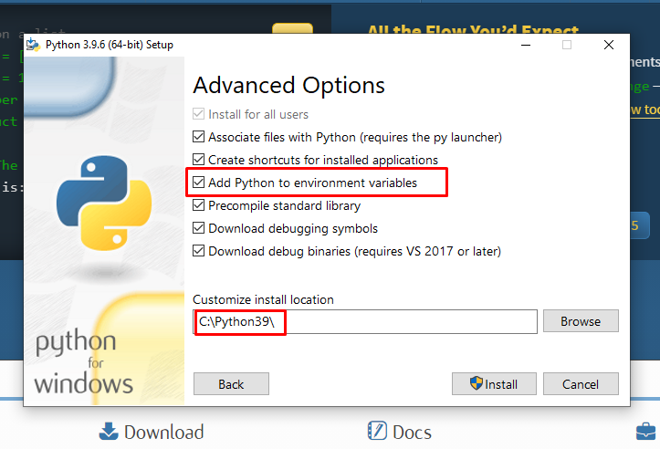
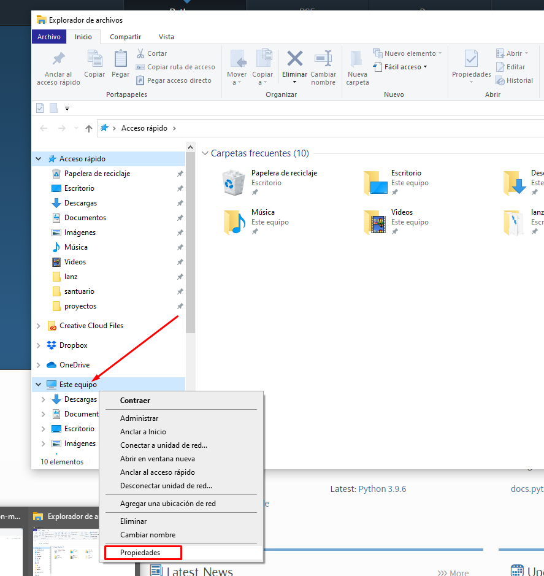
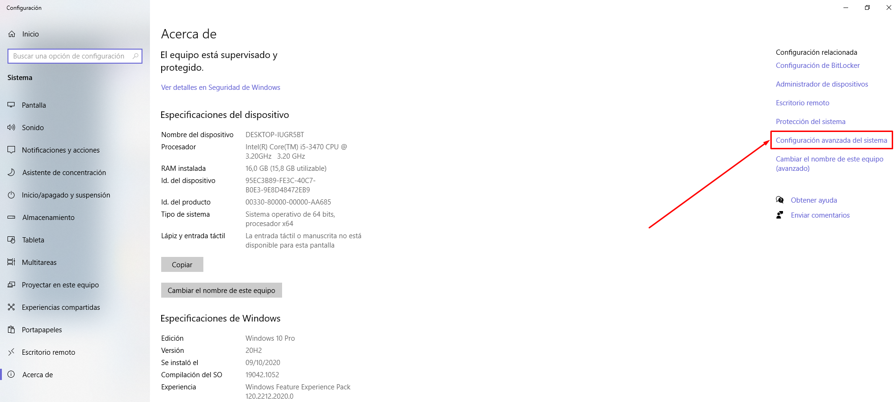
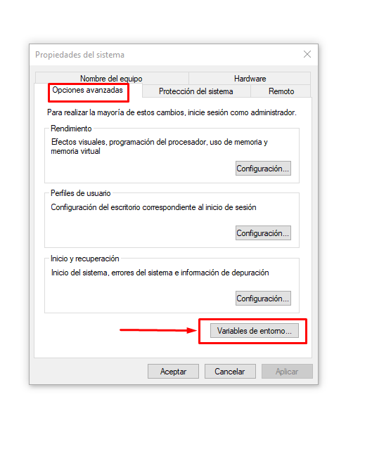
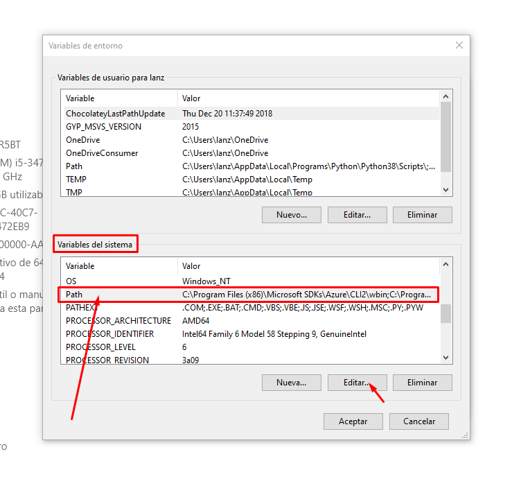
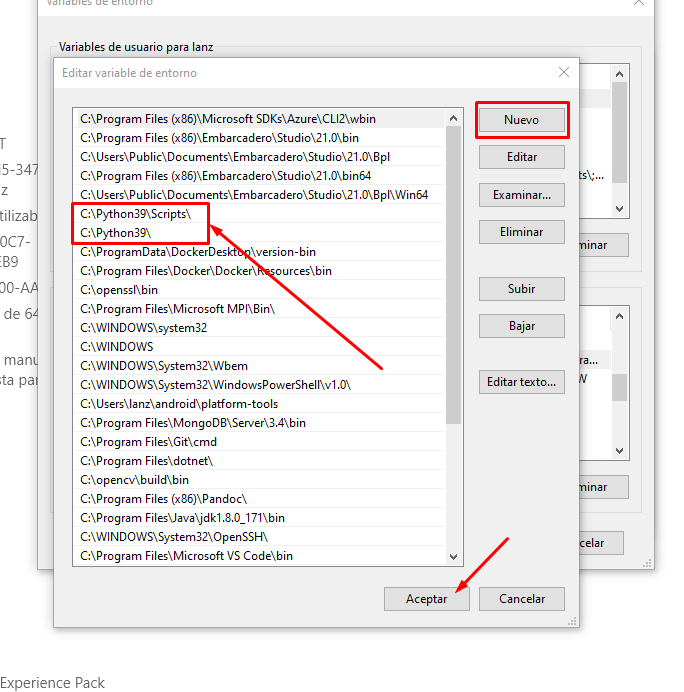
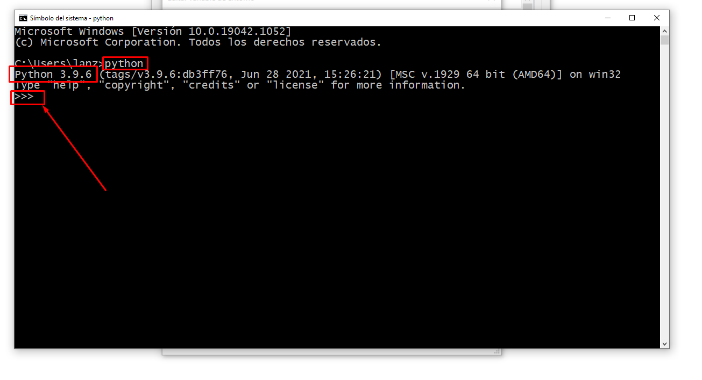

# Instalación

## Python

Python es un programa del sistema operativo que puede ser descargado desde [https://www.python.org](https://www.python.org).

> Importante: El programa python debe estar registrado a nivel sistema operativo.

